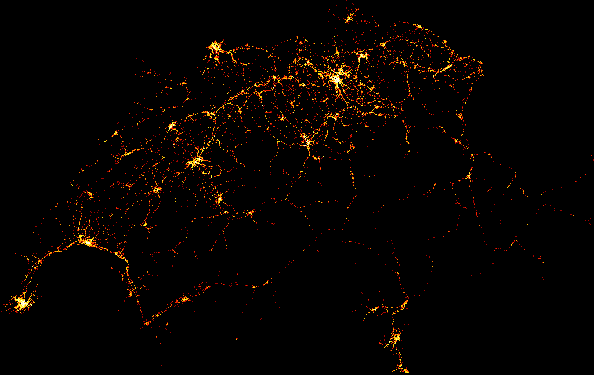
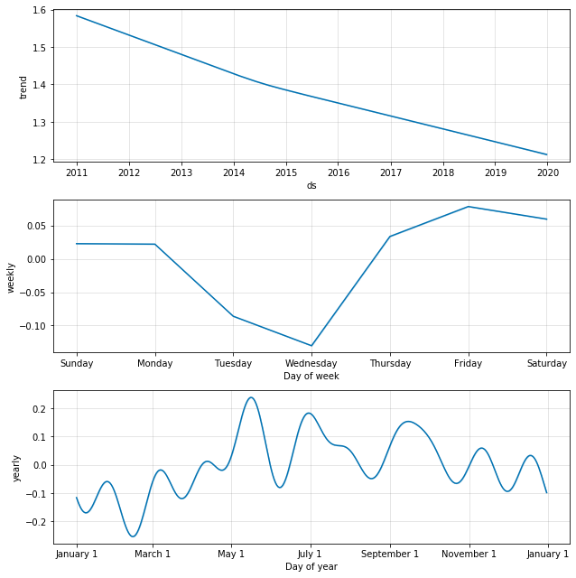

# ChRoadAccidents
## Visualization, analysis and forecasting of road traddic accidents in Switzerland

Medium article: https://medium.com/@benoit.figuet/road-accidents-in-switzerland-forecasting-a-brief-comparison-between-facebook-prophet-and-lstm-6514f585681

Forecast and analysis of road traffic accidents in switzerland using the "Strassenverkehrsunfallorte" dataset available at the following address: https://opendata.swiss/en/dataset/strassenverkehrsunfalle-mit-personenschaden

Planned Work:

    Accidents localisation visualization.
    Accidents number forecasting for 2019
    Accidents number forecasting for 2018 to check that it matches with reality
    Accidents with fatalities analysis (TBD)
    
Accidents location in switzerland between 2011 and 2018:

Accidents with fatalities seasonality and forecasting [Number of accidents with fatalities per day]

